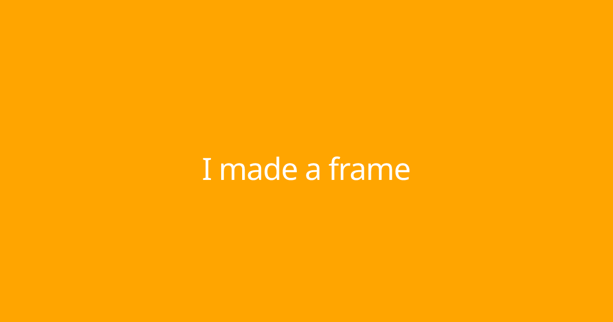

A little experiment in using query params to customize a frame.

I think you can probably do some pretty cool stuff with this.

Hosted at https://banner-frame.vercel.app/api

Supported params currently are:
- text
- size
- color

Example in a cast: https://warpcast.com/maurelian.eth/0x6ad5f98a

Example customize frame: https://banner-frame.vercel.app/api?size=60&color=green&text=hello+world

## Usage

```
npm install
npm run dev
```

Head to http://localhost:3000/api
